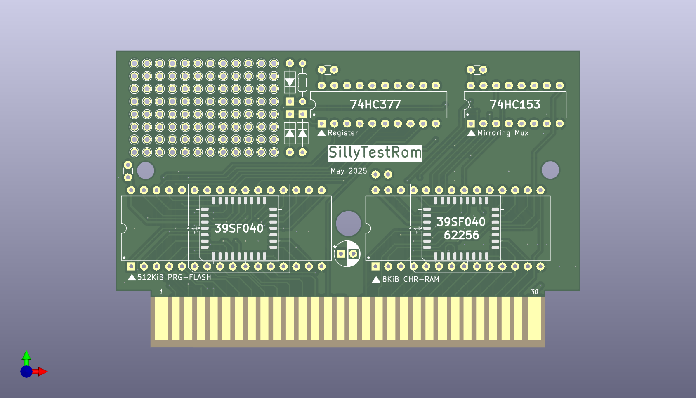
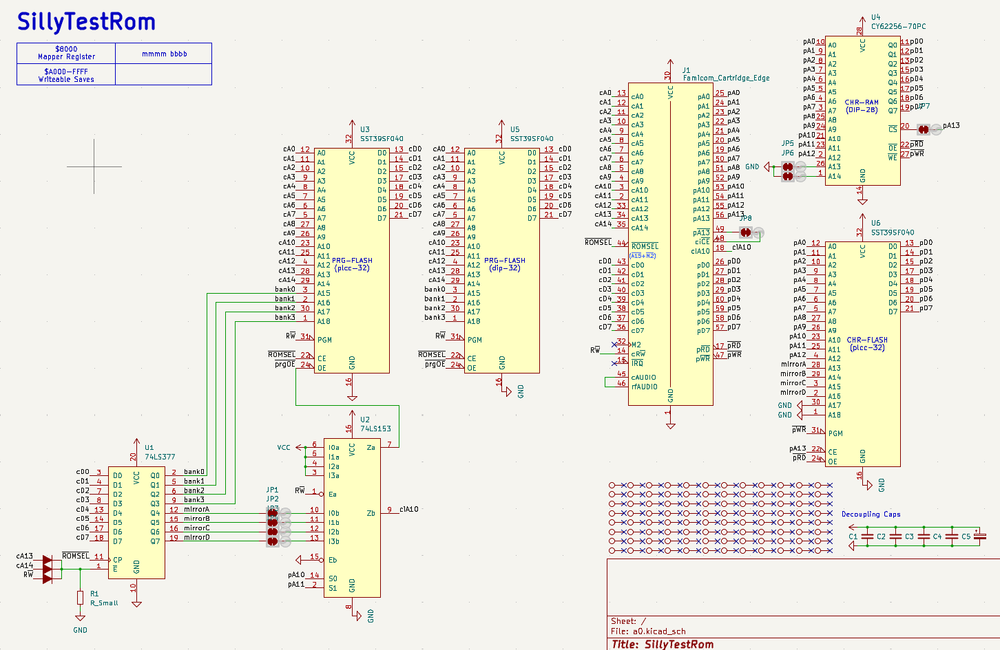

# SillyTestRom




"SillyTestRom" is a simple discrete logic mapper for the famicom/clone that I made for my own personal messing around with homebrew:

* 512 KiB PRG-FLASH (re-writabble)
* 8KiB CHR-RAM
* Arbitrary Nametable Mirroring

The board can also be bodged into other configurations.

Mapper ICs:
* 74HC377 (8bit register with enable, mapper register)
* 74HC153 (dual 4→1 multiplexer, mirroring logic and chip-enable not gate)

## Register (0x8000-0x9FFF)

There are no Bus Conflicts:

```
4321 BBBB
|    |
|    +--- PRG Bank (32K@$8000)
+-------- Nametable Mirroring

```

Each Mirroring bit controls the nametable (A or B) visible at each of the 4 logical slots, allowing for any type of (non-extended) mirroring, ie:

```
* $Ax -> Vertical
   AB
   AB
* $Cx -> Horizontal
   AA
   BB
* $0x -> Single Screen A
   AA
   AA
* $Fx -> Single Screen B
   BB
   BB
* $6x -> Diagonal
   AB
   BA
 (etc..)
```

## Flash Saves (0xA000-0xFFFF)

This area is available for writing data to the 39sf flash chip. Check the datasheet for info on how this is done.
